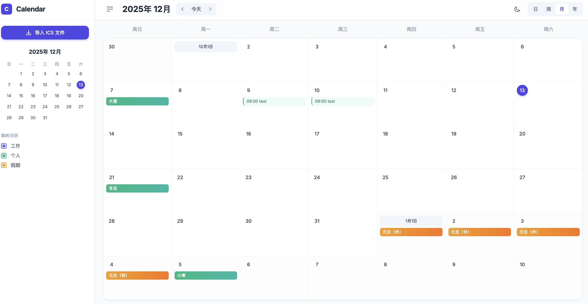
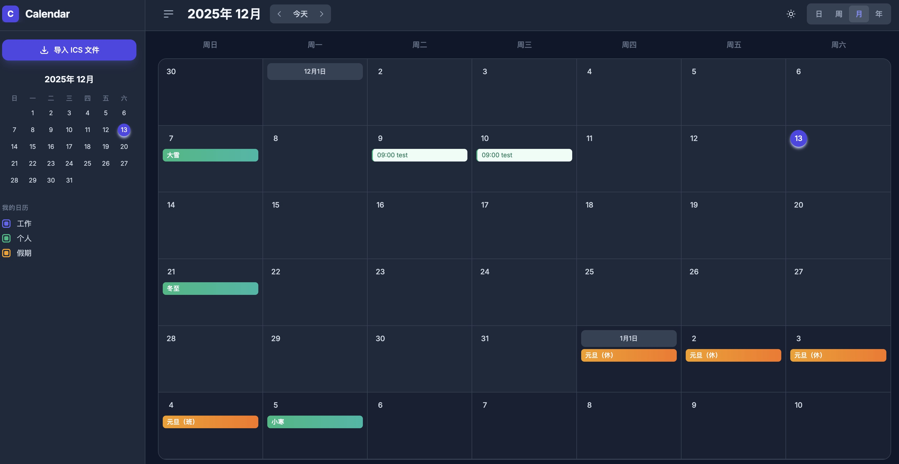
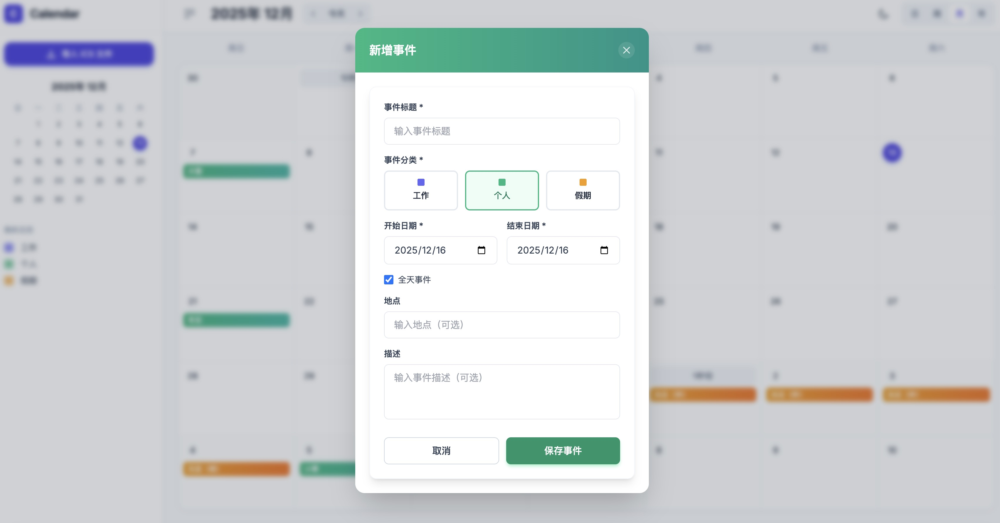

# react-calendar
 这是一个使用 react 实现的日历应用。
 四种视图模式：日、周、月、年视图自由切换

✅ 事件管理：导入 ICS、新增事件、查看详情

✅ 智能分类：自动识别工作/个人/假期事件

✅ 日期选择：双击日期或拖拽选择日期范围

✅ 数据持久化：IndexedDB 本地存储

✅ 响应式设计：完美适配桌面端和移动端

## 使用
clone 到本地之后

```
npm i 
npm run dev
```

## 效果

基本页面



暗色模式



添加事件

